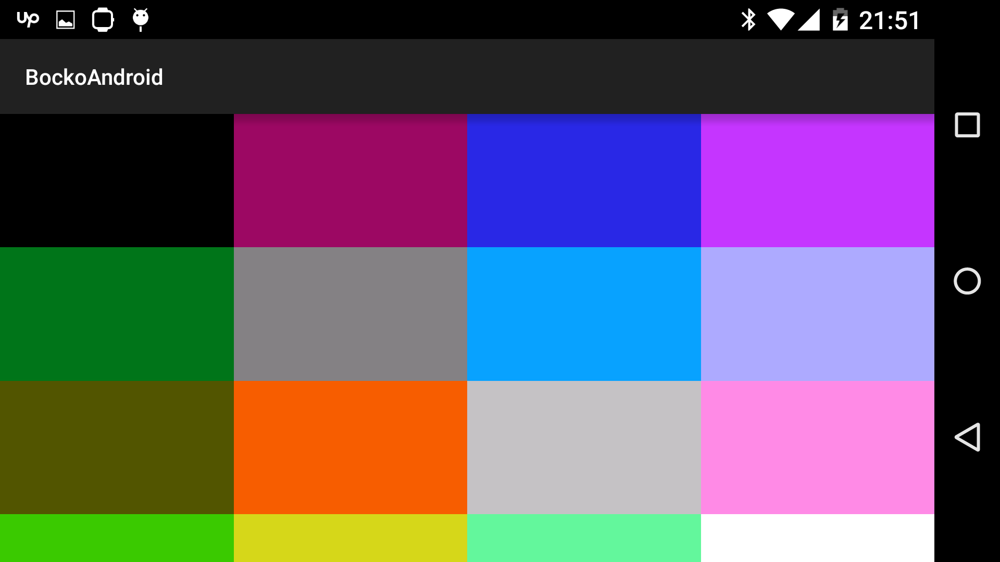

# Bocko for Android

A library for drawing with [bocko](https://github.com/mfikes/bocko) on 
Android surface view.

## Usage

Open `android/BockoAndroid` in Android Studio
and change `android/BockoAndroid/app/src/main/java/com/nvbn/bockoandroid/BockoView.java:getUrl`
to `file:///android_asset/index.html` if you want to put compiled
cljs in apk or to something like `http://192.168.0.107:3449/` if you
want to use figwheel.

Example usage:

```clojure
(require '[bocko-android.core :refer [init])
(require '[bocko.core :as b])

(init)

(doseq [[c n] (map vector
                   [:black :red :dark-blue :purple
                    :dark-green :dark-gray :medium-blue :light-blue
                    :brown :orange :light-gray :pink
                    :light-green :yellow :aqua :white]
                   (range))]
  (b/color c)
  (let [x' (* 10 (rem n 4))
        y' (* 10 (quot n 4))]
    (doseq [x (range x' (+ 10 x'))
            y (range y' (+ 10 y'))]
      (b/plot x y))))
```

Result:



For more information see [examples](https://github.com/nvbn/bocko-android/blob/master/src/bocko_android/example.cljs)
and [bocko](https://github.com/mfikes/bocko) for usage on cljs side. 

## License

Distributed under the Eclipse Public License either version 1.0 or (at
your option) any later version.
